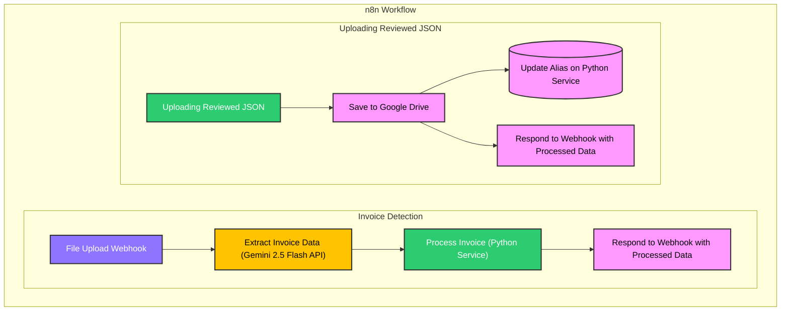

# Invoice Agent

An automated invoice processing system using n8n and a Python backend to extract data from invoices, match products against a database, and learn from manual corrections.

## Features

- **Automated Invoice Parsing**: Uses Google's Gemini 2.5 Flash model to extract structured data from uploaded invoice files (e.g., PDF, PNG, JPG).
- **Product Fuzzy Matching**: Matches extracted line items against a product database using a combination of alias map and fuzzy matching algorithms.
- **Self-Learning Alias System**: Learns from manually corrected product matches to improve accuracy over time. A human-in-the-loop workflow.
- **Containerized**: The entire application is containerized using Docker and managed with Docker Compose for easy setup and deployment.
- **Web Interface**: Includes a Streamlit application for interacting with the uploading and product matching functionality.

## Architecture

The system consists of two main services orchestrated by Docker Compose:

1.  **n8n Service**: A workflow automation tool that orchestrates the entire invoice processing pipeline, from receiving the file to calling the AI model and our Python service.
2.  **Python Service**: A Flask-based web service that handles the logic for product matching and maintains a database of product aliases.
    > Why? Since the n8n Code node doesn't support the installation of Python or JavaScript libraries, we need to use an extra service to handle the complex logic.

## Getting Started

### Prerequisites

- Docker Desktop
- A Google Gemini API Key
- A Google Drive API Credential (GCP)

### Setup

1.**Clone the repository:**
`bash
    git clone https://github.com/ghnmqdtg/Invoice-Agent.git
    cd Invoice-Agent
    `

2.  **Run the docker:**

    ```bash
    docker-compose up -d
    ```

3.  **Configure n8n:**

    - Go to `http://localhost:8080` and login with your n8n account.
    - Import `workflow/Invoice_Agent.json` into your n8n workflow.
    - Update the Gemini API Key in the `Extract Invoice Data` node within the n8n workflow.

4.  **Prepare product database:**

    - Put product database in `DB` folder and rename it to `product_dataset.xlsx`.
    - Convert the xlsx to csv.
      ```bash
      python utils/excel_converter.py
      ```

5.  **Initialize Streamlit App:**

    Run the following command to initialize the Streamlit app.

    ```bash
    streamlit run python-scripts/streamlit_app.py
    ```

## Workflow

The core logic is orchestrated in n8n and relies on the Python backend for specialized tasks.

### Main Invoice Processing Workflow

This workflow is triggered when a user uploads an invoice file.

<!-- TODO: Redefine colors and node styles -->



### Human-in-the-Loop (HITL) & Alias Mapping Workflow

Sometimes the AI fails to match the items correctly. We need to manually correct the `matched_name` for these items in the frontend. The workflow is as follows:

1.  The user receives the processed JSON with unmatched items.
2.  They correct the `matched_name` for these items.
3.  The corrected JSON is submitted to a dedicated `Uploading Reviewed JSON` webhook in n8n. It triggers the `Update Alias` node, which calls the `/update-alias` endpoint on the Python service.
4.  Python service then updates the `product_alias.csv` with the corrected `original_name` as `alias_name`. Also, pair the `product_id` with the `alias_name`. This helps the workflow to match them in the next run.
