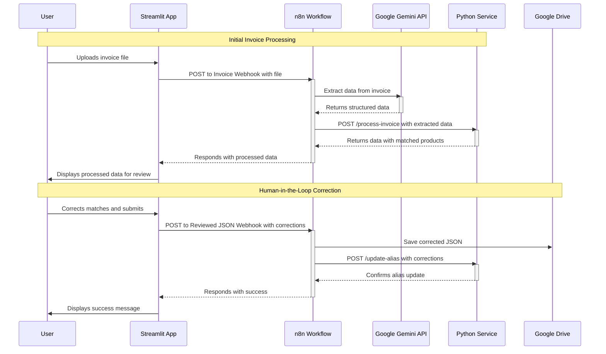

# Invoice Agent

An automated invoice processing system using n8n and a Python backend to extract data from invoices, match products against a database, and learn from manual corrections.


## Features

- **Automated Invoice Parsing**: Uses Google's Gemini 2.5 Flash model to extract structured data from uploaded invoice files (e.g., PDF, PNG, JPG).
- **Product Fuzzy Matching**: Matches extracted line items against a product database using a combination of alias map and fuzzy matching algorithms.
- **Dynamic Alias Mapping**: Creates a mapping from invoice item names to product database entries based on user corrections, improving future accuracy.
- **Containerized**: The entire application is containerized using Docker and managed with Docker Compose for easy setup and deployment.
- **Web Interface**: Includes a Streamlit application for interacting with the uploading and product matching functionality.

## Getting Started

### Prerequisites

- Docker Desktop
- A Google Gemini API Key
- A Google Drive API Credential (GCP)

### Setup

1. **Clone the repository:**

   ```bash
   git clone https://github.com/ghnmqdtg/Invoice-Agent.git
   cd Invoice-Agent
   ```

2. **Run the docker:**

   ```bash
   docker-compose up -d
   ```

3. **Configure n8n:**

   - Go to `http://localhost:8080` and login with your n8n account.
   - Import `workflow/Invoice_Agent.json` into your n8n workflow.
   - Update the Gemini API Key in the `Extract Invoice Data` node within the n8n workflow.
   - Create a folder in Google Drive and add it to `Save result to Google Drive` node.

4. **Prepare product database:**

   - Put product database in `DB` folder and rename it to `product_dataset.xlsx`.
   - Convert the xlsx to csv.
     ```bash
     python utils/excel_converter.py
     ```

5. **Set the config.json:**

   - Copy the example config file:
     ```bash
     cp python-scripts/config.json.example python-scripts/config.json
     ```
   - Update the `N8N_PROCESS_INVOICE_WEBHOOK` and `N8N_GDRIVE_UPLOAD_WEBHOOK` in `python-scripts/config.json` with the webhook URLs of the n8n workflow.

6. **Initialize Streamlit App:**

   Run the following command to initialize the Streamlit app.

   ```bash
   streamlit run python-scripts/streamlit_app.py
   ```

## Workflow

The invoice processing workflow is orchestrated by two main services running in Docker containers:

- **n8n Service**: This workflow automation tool orchestrates the entire pipeline, from receiving an invoice file to calling the AI model and our Python service.
- **Python Service**: A Flask-based web service that handles the logic for product matching and maintains a database of product aliases. Since n8n's code nodes have limitations on library imports, this service handles the more complex logic.

### n8n Workflow


The n8n workflow automates the entire process, from receiving an invoice to learning from user corrections. It's divided into two main parts as shown in the diagram:

**1. Uploading Invoice & Return the Detection Result in JSON**

This workflow is triggered when an invoice is uploaded.

- **`Listen to File Upload`**: A webhook node receives the invoice file from a client like the Streamlit app.
- **File Preparation**: The file is converted to a Base64 string and its MIME type is identified.
- **`Extract Invoice Data`**: The prepared file data is sent to the Google Gemini API to extract structured information. The prompt is provided in [Appendix](Appendix.md).
- **`Product Matching`**: The Gemini output is formatted into a JSON object, which is then sent to the Python service for product matching. The matching method is also provided in [Appendix](Appendix.md).
- **`Respond to Webhook`**: The final JSON, enriched with product matching results, is returned to the client.

**2. Uploading Reviewed JSON**

This workflow handles human-in-the-loop corrections to improve the system over time.

- **`Listen to the completed JSON Upload`**: A webhook receives the corrected JSON from the client.
- **Data Persistence**: The corrected JSON is saved to Google Drive for record-keeping.
- **Learning from Corrections**: The data is also sent to the `/update-alias` endpoint of the Python service. The service updates its product alias map, which improves future matching accuracy.
- **`Respond to Webhook`**: A confirmation is sent back to the client.

### Sequence Diagram



### Human-in-the-Loop (HITL) & Alias Mapping Workflow

Sometimes the AI fails to match the items correctly. We need to manually correct the `matched_name` for these items in the frontend. The workflow is as follows:

1.  The user receives the processed JSON with unmatched items.
2.  They correct the `matched_name` for these items.
3.  The corrected JSON is submitted to a dedicated `Uploading Reviewed JSON` webhook in n8n. It triggers the `Update Alias` node, which calls the `/update-alias` endpoint on the Python service.
4.  Python service then updates the `product_alias.csv` with the corrected `original_name` as `alias_name`. Also, pair the `product_id` with the `alias_name`. This helps the workflow to match them in the next run.

## File Structure

```
.
├── workflow/
│   └── Invoice_Agent.json      # n8n workflow backup
├── docker-compose.yml          # Docker Compose configuration
├── DB/
│   └── product_dataset.csv     # Product database
├── utils/
│   ├── excel_converter.py      # Excel to CSV converter
│   └── prompt_converter.py     # Convert prompt to single line
├── README.md                   # This file
├── python-scripts/
│   ├── product_matching.py     # Main Flask app for product matching
│   ├── streamlit_app.py        # Streamlit UI for testing
│   ├── matching_methods/       # Product matching algorithms
│   ├── config.json.example     # Example config file
│   └── requirements.txt        # Python dependencies
└── shared/
    ├── product_db.csv          # Your master product list
    └── product_alias.csv       # Auto-generated alias list for learning
```

## TODO List / Potential Features

- [ ] Fix: Improve the error handling
- [ ] Fix: Provide suggestion along with `unit` for the user to choose from
  > In my testing dataset, there are some items that have the same name but different unit. For example, there are two different items named `富士蘋果` with `unit` of `斤` and `KG`. We should provide a suggestion along with the `unit` to help the user to choose the correct one. Or, maybe we can involve the `unit` in the fuzzy matching to solve this problem.
- [ ] Feat: Quantify the accuracy of the matching and find out the best matching method
  > This project is just a prototype. Some of the choices are not deliberate enough. The matching method is one of them. The current method is `token_set_ratio`. We can try other methods in the `thefuzz` library.
- [ ] Feat: Provide matching suggestion for the user to choose from
  > We do have this feature on backend, but it's not implemented in Streamlit App.
- [ ] Test: Add unit tests
- [ ] Test: Handle multiple requests at once
  > Currently, I've only tested the service with one request at a time. We should test it with multiple requests at once.
- [ ] Feat: Batch processing multiple invoices at once (merge/separate)
- [ ] Feat: Let the Gemini do self-checking on product names
- [ ] Feat: Let the Gemini provide bbox (bounding box) for the invoice items
- [ ] Feat: Add interactive UI with the bbox
